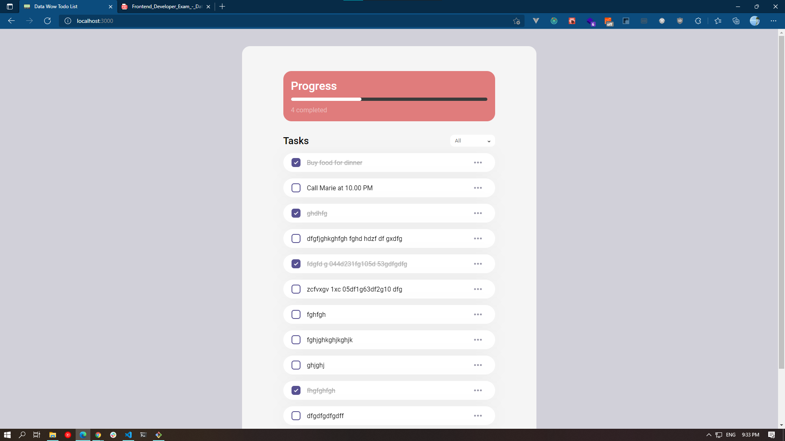

# Datawow Todo App

## Getting Started


NOTE : I'm using `yarn` as a dependency manager so, feel free to use another as your wish.

### Install dependencies (Important)
```bash
# NOTE: Please Stay at root directory
$ yarn
```

### Running the development server.

```bash
$ yarn dev
```

### Building for production.

```bash
$ yarn build
```

### Running the production server.

```bash
$ yarn start
```

## Screenshot

---
### Mobile


---
### Tablet


---
### Desktop

---

## Highlight Dependency ,Library, Framework
### **SASS/SCSS**

Sass is a stylesheet language that’s compiled to CSS. It allows you to use variables, nested rules, mixins, functions, and more, all with a fully CSS-compatible syntax.

[Go To Documentation](https://sass-lang.com/documentation)


### **Fetch**

Next.js has a built-in polyfill for the fetch API. You don't need to worry about using it on either server or client side.

[Go To Documentation](https://developer.mozilla.org/en-US/docs/Web/API/Fetch_API)


### **Storybook**

Storybook is an open source tool for developing UI components in isolation for React, Vue, Angular, and more. It makes building stunning UIs organized and efficient.

[Go To Documentation](https://storybook.js.org/docs/react/get-started/introduction)


### **React Redux**

Redux helps you write applications that behave consistently, run in different environments (client, server, and native), and are easy to test.

[Go To Documentation](https://redux.js.org/introduction/getting-started)


### **ESLint**

A pluggable and configurable linter tool for identifying and reporting on patterns in JavaScript. Maintain your code quality with ease.

[Go To Documentation](https://eslint.org/docs/user-guide/getting-started)


### **Prettier**

An opinionated code formatter; Supports many languages; Integrates with most editors.

[Go To Documentation](https://prettier.io/docs/en/index.html)


### **Testing Library**

The React Testing Library is a very light-weight solution for testing React components. It provides light utility functions on top of react-dom and react-dom/test-utils.

[Go To Documentation](https://testing-library.com/docs/)


### **Docker**

Docker simplifies and accelerates your workflow, while giving developers the freedom to innovate with their choice of tools, application stacks, and deployment environments for each project.

[Go To Documentation](https://www.docker.com/get-started)


## License

MIT
